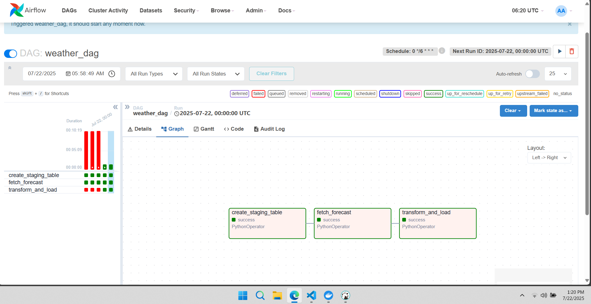
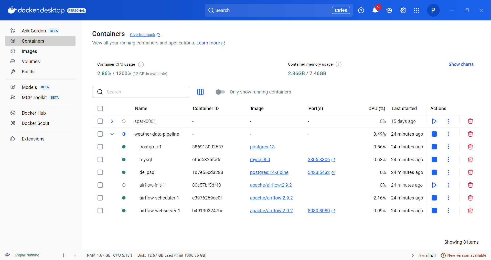

# weather-data-pipeline

Dự án sử dụng API để xây dụng 1 ETL pipeline trích xuất dữ liệu, biến đổi dữ liệu và load vào data warehouse.

## Tổng quan

Dự án này mô tả 1 vài kỹ năng chính của DE trong việc tạo 1 pipeline, cụ thể là:

1. Trích xuất dữ liệu từ API
2. Biến đổi dữ liệu thô với Pandas 
3. Load dữ liệu đã xử lý vào PostgreSQL database
4. Orchestrate toàn bộ ETL pipeline bằng Apache Airflow
5. Đóng gói dự án với Docker
## Tính năng

- Trích xuất dữ liệu từ API với thư viện Requests
- Biến đổi dữ liệu với Pandas
- Lưu dữ liệu vào PostgreSQL
- ETL workflow orchestration với Apache Airflow
- Xử lý lỗi và ghi log 
- Kiểm tra từng thành phần

## Tech Stack

- Python
- Pandas
- PostgreSQL
- Apache Airflow
- Requests

## Airflow UI

## Docker 
